

  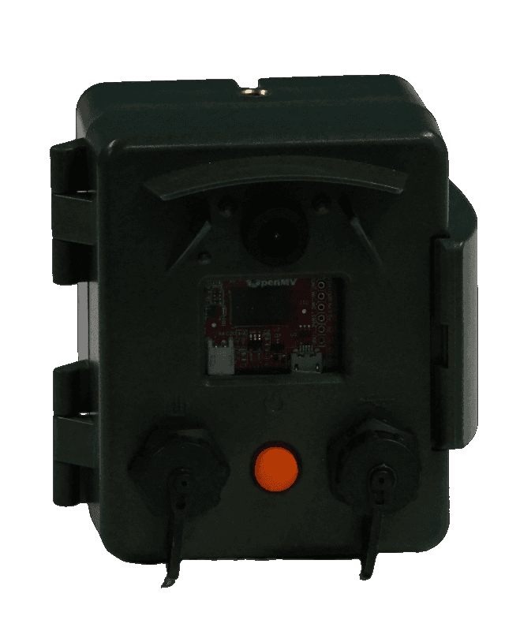

# EcoEye
EcoEye is a camera with onboard machine vision capabilities encased in a portable and waterproof housing designed for remote deployments. Based on the openMV H7 Plus Cam, it is easy to set up and flexible to numerous applications. The internal power management and control system enables long-term operation and allows the integration of solar panels, countless sensors, and other external devices. The camera is thoroughly field tested, and the results are published in a scientific article.

The EcoEye camera can be ordered on [Seeed studio](https://www.seeedstudio.com/EcoEye-Embedded-Vision-Camera-p-5843.html).

## Description
The ecoEye camera is a portable, low-power camera with a waterproof housing. It protects the OpenMV Cam H7 Plus module for on-board machine vision. Powered by 3 rechargeable lithium-ion batteries, an intelligent power management module can provide a continuous power supply and enables system deep sleep through an integrated real-time clock and the soft latch circuit that can be controlled by the user through the external push button. Recharging and data exchange can be done through the external USB-C connector. A multi-pin connector can accommodate an 18V solar panel, I2C and analog sensors, and various other external devices, making it suitable for long-term usage and multi-sensor data integration.

The ecoEye housing is carefully designed to accommodate all components and provides extra space for expansion boards and shields. It features waterproof seals and a secure latch for the door, allowing the camera to operate outdoors even in rainy and harsh conditions. The camera can be easily mounted on a regular tripod using four threads in each direction. The front face of the housing includes the image sensor lens, two IR LEDs for night illumination, an RGB LED indicator, a clear window for light shield expansions on the openMV board, and external connectors with the power switch. The lens is protected from sun glare and water droplets, and the well-designed cap structures prevent water accumulation when the camera is placed facing upwards.

Using the openMV IDE, you can program the camera in Python using available examples or custom code. The IDE provides a simple interface with a serial terminal and real-time image frame buffer, making it easy to write, run, debug, and set up the camera. The provided script code offers a user-friendly way to configure the camera for various monitoring applications without needing advanced knowledge of micropython or board functions. Basic parameters can be configured by the user, while most other settings are automatically handled in the background.

## Features
- High-performance Cortex-M7 CPU for embedded vision applications
- OV5640 high resolution image sensor with up to 5MP (2592x1944) frame size
- Micro-SD card socket with 100Mbs read/write speeds
- Interchangeable lens for different focal lengths requirements
- Automatic power management with ultra low-power mode, power switch, real-time, USB/solar charging, and sensor integration capability
- Integrated battery compartment for up to 10200 mAh energy capacity
- Waterproof housing designed for portability, compactness, and flexible mounting for discrete outdoor deployments
- External user interface through power switch, USB-C and multi-pin connectors
- Frontal RGB indicator LED and two high power 850nm IR illumination LEDs
- Additional light shield (white, IR, UV) mounting capability
- USB type-C fast charging and full speed 12Mbs data transfer with computer
- Easy-to-use application setup with fully integrated micropython code on the OpenMV IDE

## Applications
- Ecosystem service (Pollination, Pest Control) monitoring
- Biodiversity monitoring
- Conservation management
- Phenology camera
- Environmental education
- Continuous image capture
- Motion detection
- Blob classification
- Image classification
- Objects classification
- Region-of-interest classification

## Hardware Overview

  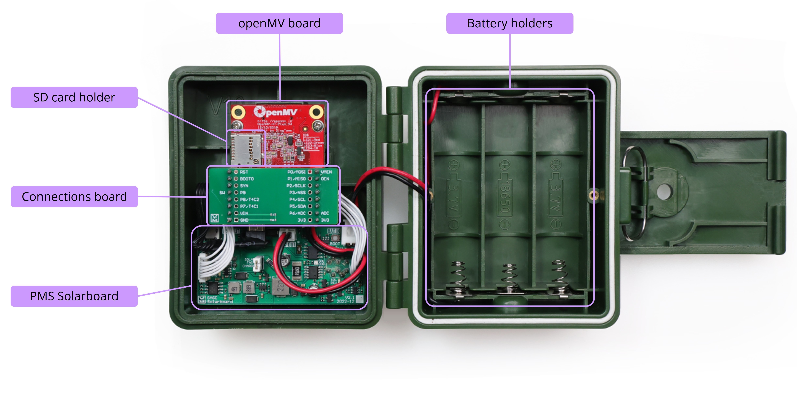
  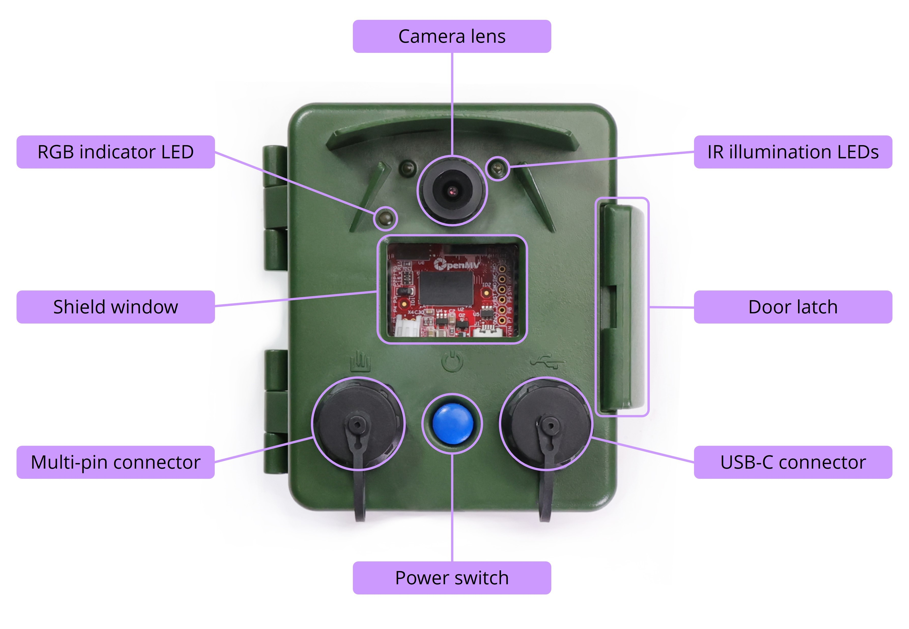

## Part List
- Fully assembled EcoEye camera (with the standard 2.8mm lens; batteries and SD card not included)
- USB-C data cable
- 1.8mm lens
- 6.0mm lens
- 12.0mm lens

  

# Use Cases
## Waterbirds recognition real-time alerts for Conservation biology
In this setup, the EcoEye camera was used to recognize male and female mandarin ducks that cross a small section on a lake. The object detection model was trained with images taken from different locations, at various weather conditions and times of the day. When an image includes one or multiple detections above a set threshold, the detections count and confidences are transferred along with the compressed image to a cloud server, over the WiFi signal from a portable router, in real-time.

  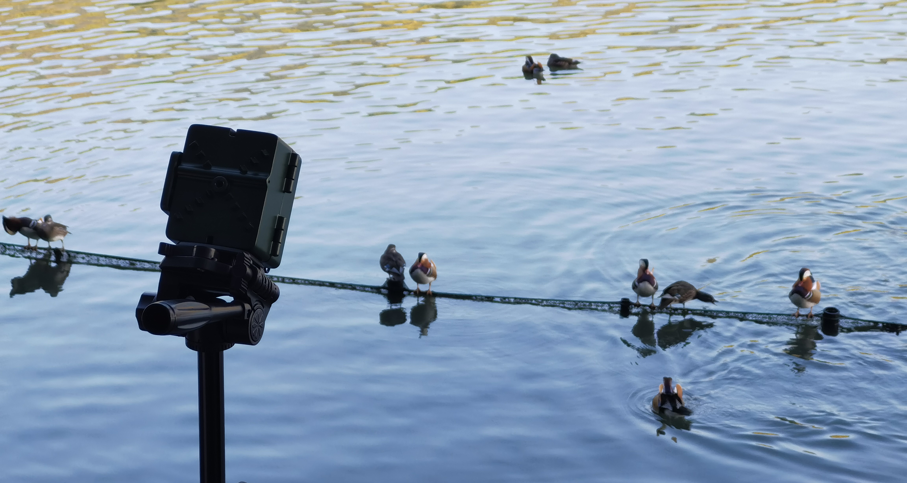

The camera resulted in field accuracies of 74% for female and 96% for male mandarin ducks obtained from 594 raw detections.

  
  &nbsp;
  

Due to the fast consecutive detections at times, not all the data were sent to the cloud server, more specifically 82% of the count and confidence data, and 80% of the detected images were uccessfully transferred.

  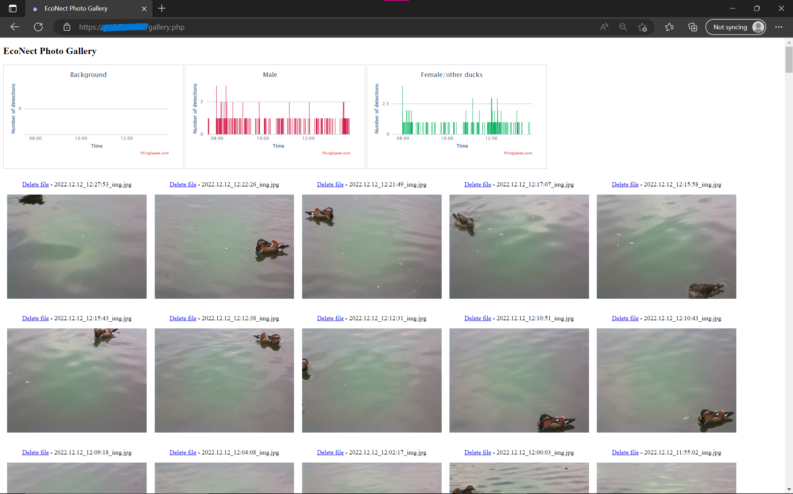

## Phenology monitoring of plants for Soil treatment evaluation
This plant monitoring application was carried out to evaluate the sensor integration and solar charging functions of the power management system of the EcoEye camera. During 4 months, the device captured top-view images of the plants, every 30 minutes form sunrise until sunset, and evaluated the pixel-based plant growth through a blob detection color tracking algorithm, while also measuring environmental data from various sensors placed above and in the soil. 

  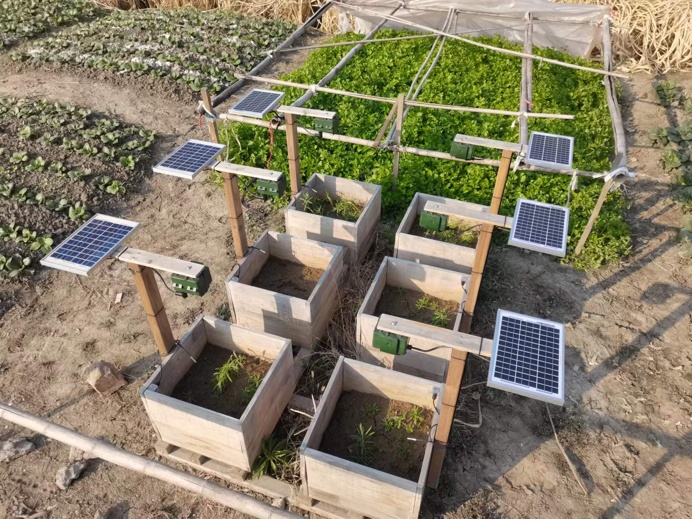
  &nbsp;
  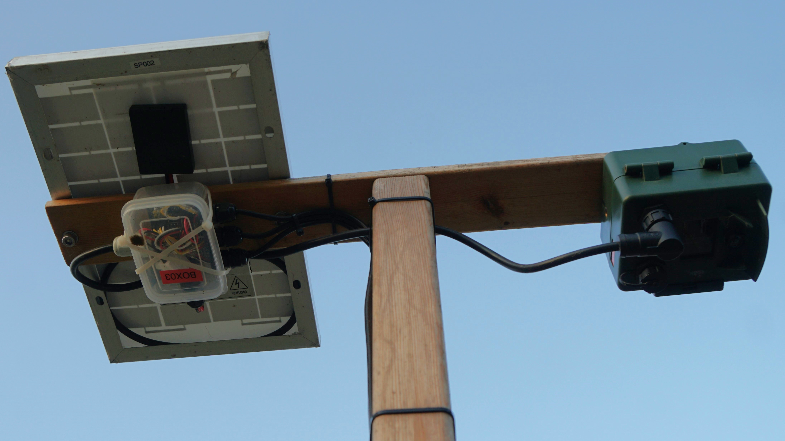

  
    
  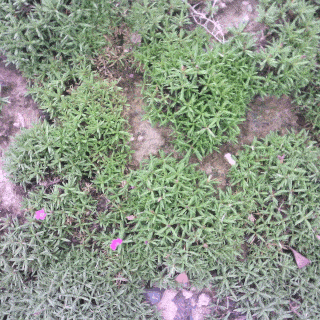
  &nbsp;
  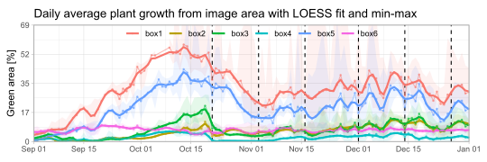

## Flying nocturnal insects classification for Pest monitoring
The ecoEye camera is uesd to collect insect data in rice fields with the blob detection method. Subsequently, this data can be used for pest control. First, raw image data is collected, and the captured insects are analyzed. After creating a classification model with the collected data, the camera can be set up near rice fields to automatically identify and analyze the visiting insects. Currently, the accuracy of the built model is being verified.

  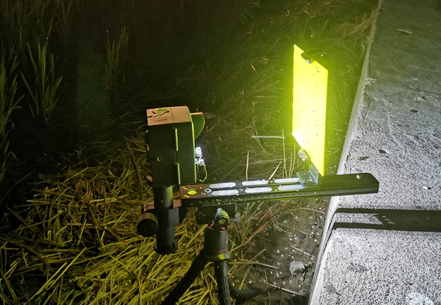
    
  
  &nbsp;
  
    
  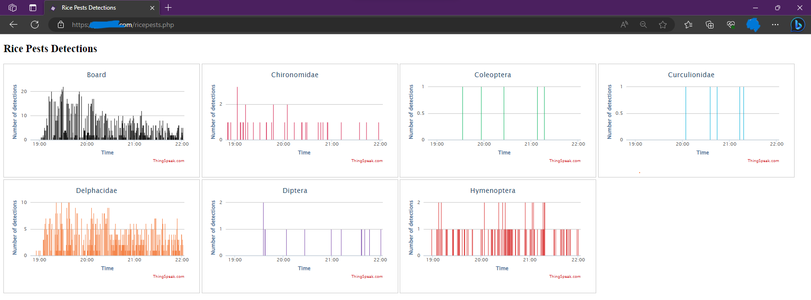

## Flying bats and insects detection for Landscape ecology

  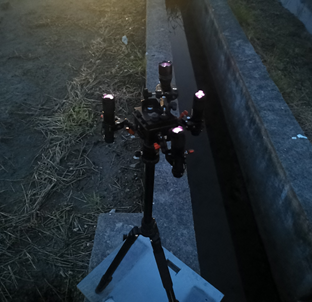
  &nbsp;
  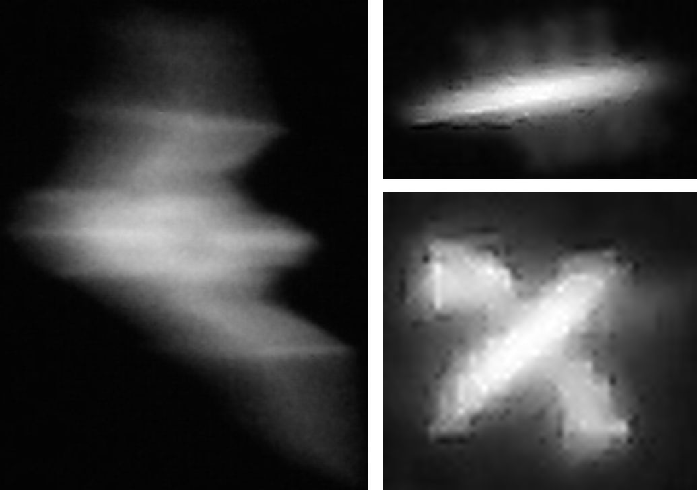

## Cocoa flower visitors detection for Pollination ecology
The goal of this use case is to understand how different intercropping patterns influence cocoa pollinators. For this, the true pollinators of cocoa trees must be identified first. Then, these pollinators can be monitored in different intercropping fields. Currently, we have already detected the true pollinator and the ecological project is ongoing. 

  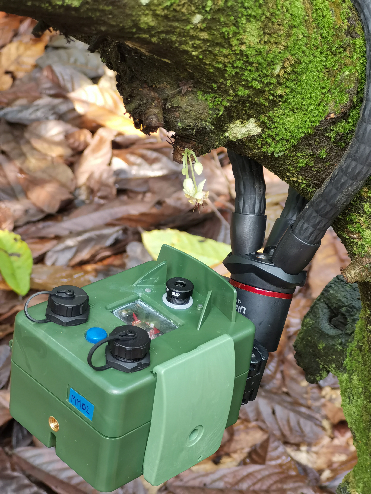
  &nbsp;
  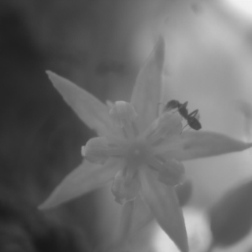

Hainan May 2023 – technical details: Currently there are 12 cameras being deployed continuously in the fields. While running the insect frame differencing script, the device consumes about 1.9W. Each camera holds 3 internal batteries and 4 additional ones in an external power bank, summing up to a capacity of 23Ah (23450mAh, with the 3350mAh batteries we are using). With this power supply the device can monitor continuously for up to 48h. However, due to the charging-stop algorithm of the power bank output, most deployments last about 30 hours which is still enough to monitor the flower during its entire opening period.

# Education
## Plant Boxes

