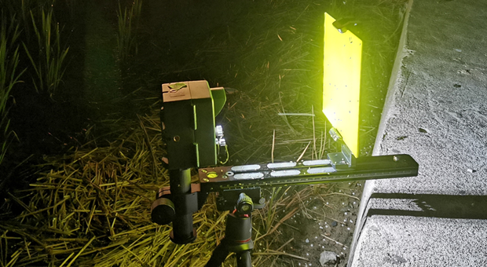
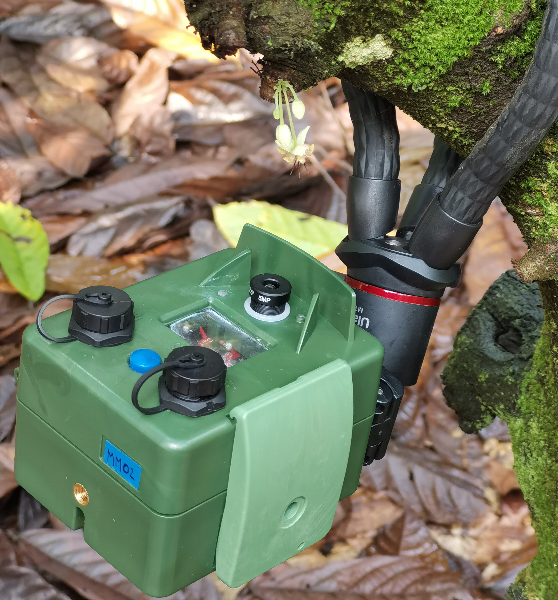
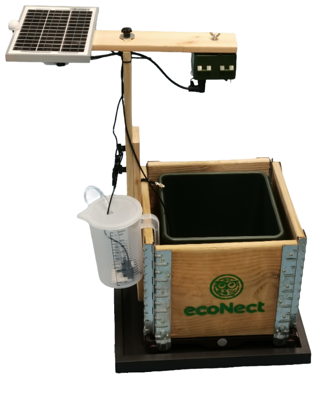

  

# EcoEye
EcoEye is a camera with onboard machine vision capabilities encased in a portable and waterproof housing designed for remote deployments. Based on the openMV H7 Plus Cam, it is easy to set up and flexible to numerous applications. The internal power management and control system enables long-term operation and allows the integration of solar panels, countless sensors, and other external devices. The camera is thoroughly field tested, and the results are published in a [scientific article](https://www.biorxiv.org/content/10.1101/2023.07.26.550656v1.abstract).

The EcoEye camera can be ordered on [Seeed studio](https://www.seeedstudio.com/EcoEye-Embedded-Vision-Camera-p-5843.html).

## Description
The ecoEye camera is a portable, low-power camera with a waterproof housing. It protects the OpenMV Cam H7 Plus module for on-board machine vision. Powered by 3 rechargeable lithium-ion batteries, an intelligent power management module can provide a continuous power supply and enables system deep sleep through an integrated real-time clock and the soft latch circuit that can be controlled by the user through the external push button. Recharging and data exchange can be done through the external USB-C connector. A multi-pin connector can accommodate an 18V solar panel, I2C and analog sensors, and various other external devices, making it suitable for long-term usage and multi-sensor data integration.

The ecoEye housing is carefully designed to accommodate all components and provides extra space for expansion boards and shields. It features waterproof seals and a secure latch for the door, allowing the camera to operate outdoors even in rainy and harsh conditions. The camera can be easily mounted on a regular tripod using four threads in each direction. The front face of the housing includes the image sensor lens, two IR LEDs for night illumination, an RGB LED indicator, a clear window for light shield expansions on the openMV board, and external connectors with the power switch. The lens is protected from sun glare and water droplets, and the well-designed cap structures prevent water accumulation when the camera is placed facing upwards.

Using the openMV IDE, you can program the camera in Python using available examples or custom code. The IDE provides a simple interface with a serial terminal and real-time image frame buffer, making it easy to write, run, debug, and set up the camera. The provided script code offers a user-friendly way to configure the camera for various monitoring applications without needing advanced knowledge of micropython or board functions. Basic parameters can be configured by the user, while most other settings are automatically handled in the background.

## Features
- High-performance Cortex-M7 CPU for embedded vision applications
- OV5640 high resolution image sensor with up to 5MP (2592x1944) frame size
- Micro-SD card socket with 100Mbs read/write speeds
- Interchangeable lens for different focal lengths requirements
- Automatic power management with ultra low-power mode, power switch, real-time, USB/solar charging, and sensor integration capability
- Integrated battery compartment for up to 10200 mAh energy capacity
- Waterproof housing designed for portability, compactness, and flexible mounting for discrete outdoor deployments
- External user interface through power switch, USB-C and multi-pin connectors
- Frontal RGB indicator LED and two high power 850nm IR illumination LEDs
- Additional light shield (white, IR, UV) mounting capability
- USB type-C fast charging and full speed 12Mbs data transfer with computer
- Easy-to-use application setup with fully integrated micropython code on the OpenMV IDE

## Applications
- Ecosystem service (Pollination, Pest Control) monitoring
- Biodiversity monitoring
- Conservation management
- Phenology camera
- Environmental education
- Continuous image capture
- Motion detection
- Blob classification
- Image classification
- Objects classification
- Region-of-interest classification

## Hardware Overview

  
  

## Part List
- Fully assembled EcoEye camera (with the standard 2.8mm lens; batteries and SD card not included)
- USB-C data cable
- 1.8mm lens
- 6.0mm lens
- 12.0mm lens

  

# Use Cases
## Waterbirds recognition real-time alerts for Conservation biology
In this setup, the EcoEye camera was used to recognize male and female mandarin ducks that cross a small section on a lake. The object detection model was trained with images taken from different locations, at various weather conditions and times of the day. When an image includes one or multiple detections above a set threshold, the detections count and confidences are transferred along with the compressed image to a cloud server, over the WiFi signal from a portable router, in real-time.

  

The camera resulted in field accuracies of 74% for female and 96% for male mandarin ducks obtained from 594 raw detections.

  
  &nbsp;
  

Due to the fast consecutive detections at times, not all the data were sent to the cloud server, more specifically 82% of the count and confidence data, and 80% of the detected images were uccessfully transferred.

  

## Phenology monitoring of plants for Soil treatment evaluation
This plant monitoring application was carried out to evaluate the sensor integration and solar charging functions of the power management system of the EcoEye camera. 

  
  &nbsp;
  

During 4 months, the device captured top-view images of the plants, every 30 minutes form sunrise until sunset, and evaluated the pixel-based plant growth through an on-board blob detection color tracking algorithm, while also measuring environmental data from various sensors placed above and in the soil. With the low-power sleep mode in between measure times, the overall power concumption is reduced enough for the camera to be self-sustainable with a 5W solar panel.

  
    
  
  &nbsp;
  

## Flying nocturnal insects classification for Pest monitoring
With the white LED shield mounted inside the EcoEye camera, illuminating a yellow board, the setup was used to collect insect data in rice fields for pest control management.  

  

First, the captured image is compared with a reference frame to detect motion and then, the resulting blobs of the flying targets are classified with a model that was trained to differenciate nine insect species. The final calculated field accuracies for non-pest species ranged from 8% for curculionidae (due to only 39 training images) to 93% for coleoptera, and for potential planthopper pests the accuracies were between 55% and 83%.

  
  &nbsp;
  

Additionally, whenever a classification confidence reached a minimum threshold, the species detection count was sent to a cloud server via the installed WiFi shield module connected to a 4G portable router.

  

## Flying bats and insects detection for Landscape ecology
To evaluate pest control services provided by bats predating on insects in natural and agricultural landscapes, flying insects and bats were monitored in a rice field with a nearby forest. The EcoEye camera, running the blob detection algorithm at an average of 1.32 frames per seconds, was equipped with four infrared torch lamps, to capture flying objects up to 7m above ground. The output bounding boxes were classified into bats, insects, or unknown flying objects with the previously trained CNN. In the latest deplyment, bats were classified correctly 67% of the time while insects had a field accuracy of 93%.

  
  &nbsp;
  

## Cocoa flower visitors detection for Pollination ecology
In this use case, cocoa flowers are monitored during their opening period to understand which visiting insects are pollinators. As these flowers are very small, typically 1cm across, the camera was equipped with a macro lens and placed close to the flower. The blob detection method is used to capture and save images of any moving targets on the flower. As this continuous operation cosumes about 1.9W, the camera is setup with an external power bank, bringing the total capacity to 23Ah, allowing the device to run up to 48 hours which is enough to monitor the flower during its entire opening period. At night the internal infrared LEDs are turned on to illuminate the target without disturbing the visiting insects. 

  
  &nbsp;
  

# Education
The EcoEye camera can not just be used for reasearch and development purposes, but also serves as a great tool to introduce students into ecology, programming and data analysis.

## Plant Boxes
In a collaborative pilot project with Wahaha school, the ecoNect team developed a plant box, derived from the phenology use case setup described above, that facilitates the installation process and use case planning. It incoporates the most useful features that the EcoEye camera offers : embedded vision through either blob detection, image classification or object recognition, multi-sensor integration and automatic management, self-sustainability with solar power harvesting and the low-power sleep mode, and time-accurate device control.

  

Through the waterproof multi-pin plug, the EcoEye camera is connected to the 'Splitterbox' thats acts a multi-socket for ta solar panel, multiple I2C-protocol and analog sensors, and a controllable 3.3V or 5V device. The plant box setup features a 5W solar panel, that is largely enough to keep phenology applications, with wake-up intervals as often as every 15 minutes, running indefinitly. Two SHT40 temperature and humidity sensors probes are installed to measure soil and ambient environmental data, which can be automatically detected and read from by the EcoEye camera. Finally, a small water pump, used for watering the plants, can be activated based on the soil humidity measurements or at programmed times of the day.

