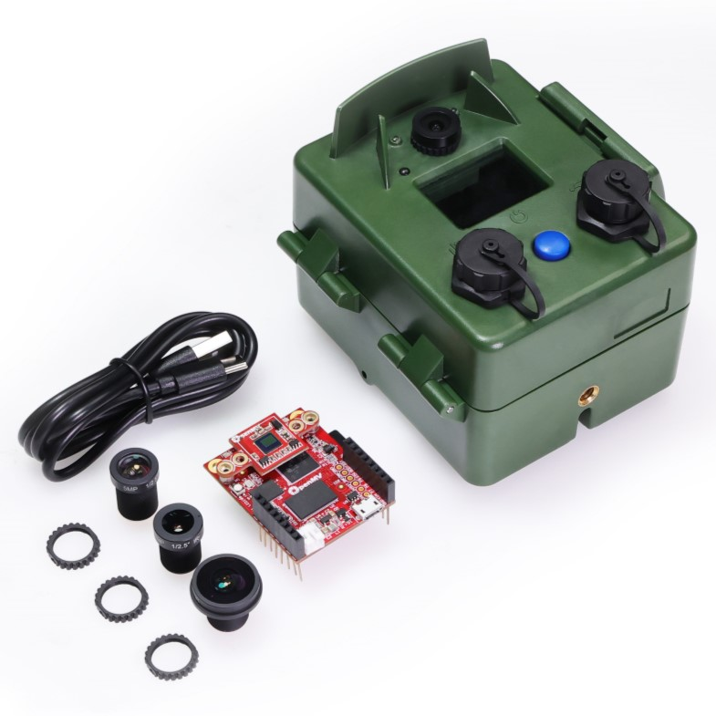

  

# EcoEye
EcoEye is a camera with onboard machine vision capabilities encased in a portable and waterproof housing designed for remote deployments. Based on the openMV H7 Plus Cam, it is easy to set up and flexible to numerous applications. The internal power management and control system enables long-term operation and allows the integration of solar panels, countless sensors, and other external devices. The camera is thoroughly field tested, and the results are published in a scientific article.

The EcoEye camera can be ordered on [Seeed studio](https://www.seeedstudio.com/EcoEye-Embedded-Vision-Camera-p-5843.html).

## Description
The ecoEye camera is a portable, low-power camera with a waterproof housing. It protects the OpenMV Cam H7 Plus module for on-board machine vision. Powered by 3 rechargeable lithium-ion batteries, an intelligent power management module can provide a continuous power supply and enables system deep sleep through an integrated real-time clock and the soft latch circuit that can be controlled by the user through the external push button. Recharging and data exchange can be done through the external USB-C connector. A multi-pin connector can accommodate an 18V solar panel, I2C and analog sensors, and various other external devices, making it suitable for long-term usage and multi-sensor data integration.

The ecoEye housing is carefully designed to accommodate all components and provides extra space for expansion boards and shields. It features waterproof seals and a secure latch for the door, allowing the camera to operate outdoors even in rainy and harsh conditions. The camera can be easily mounted on a regular tripod using four threads in each direction. The front face of the housing includes the image sensor lens, two IR LEDs for night illumination, an RGB LED indicator, a clear window for light shield expansions on the openMV board, and external connectors with the power switch. The lens is protected from sun glare and water droplets, and the well-designed cap structures prevent water accumulation when the camera is placed facing upwards.

Using the openMV IDE, you can program the camera in Python using available examples or custom code. The IDE provides a simple interface with a serial terminal and real-time image frame buffer, making it easy to write, run, debug, and set up the camera. The provided script code offers a user-friendly way to configure the camera for various monitoring applications without needing advanced knowledge of micropython or board functions. Basic parameters can be configured by the user, while most other settings are automatically handled in the background.

## Features
- High-performance Cortex-M7 MCU and 5MP image sensor
- Automatic power management with low-power mode, power switch, real-time, USB/solar charging, and sensor integration capability
- Waterproof housing designed for portability, compactness, and flexible mounting for discrete outdoor deployments
- Easy-to-use application setup with fully integrated micro python code on the OpenMV IDE

## Applications
- Ecosystem service (Pollination, Pest Control) monitoring
- Biodiversity monitoring
- Conservation management
- Phenology camera
- Environmental education
- Continuous image capture
- Motion detection
- Blob classification
- Image classification
- Objects classification
- Region-of-interest classification

## Hardware Overview

  
  

## Part List
- Fully assembled EcoEye camera (with the standard 2.8mm lens on it, batteries, and SD card not included)
- USB-C data cable
- 1.8mm lens
- 6.0mm lens
- 12.0mm lens

  

